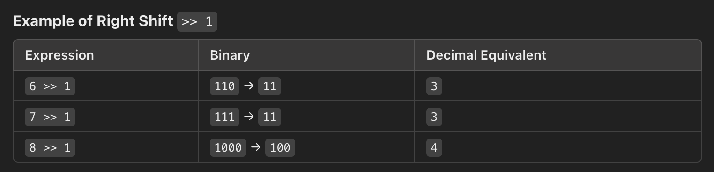

### 704 & 27 & 977

### Array
1. The index of elements in an array starts from 0.
2. The memory addresses of an array are contiguous.
3. The size of an array is fixed, the elements cannot be removed, only can be **overwritten**. Delete an element in an array can only replace it with a new value, but the array size remains unchanged.(Can use **ArrayList** for actual deletion.)

### 704.Binary Search
  https://leetcode.com/problems/binary-search/description/

  
   
• Bitwise Right Shift

    int mid = (left+right)/2;

This was my first thought, but learned from the tutorial that this might cause integer overflow when "left+right>Integer.MAX_VALUE (2^31 - 1)"

    int mid = left + ((right - left) >> 1);

The >> operator is a bitwise right shift operator. Divide (right-left) by 2 using bitwise oeprations.

• Scenario 1: [left, right]   left-inclusice, right-inclusive
    
    while(left <= right){...}
必须使用<=， 因为left==right是有意义的。

target    < nums[mid] , left boundry is correct , right = mid-1；

nums[mid] < target    , right boundry is correct, left  = mid+1；

 

<pre><code class="java">
class Solution {
    public int search(int[] nums, int target) {

        #avoid unnecessary iterations
        if (target < nums[0] || target > nums[nums.length - 1]){
            return -1;
        }

        int left = 0, right = nums.length-1;

        while(left <= right){
            int mid = left + ((right-left) >> 1);

            if (nums[mid]==target){
                return mid;
            }
            else if (nums[mid]<target){
                left = mid+1;
            }
            else{
                right = mid-1;
            }
        }
        return -1;
    }
}
</code></pre>

 

• Scenario 2: [left, right)   left-inclusice, right-exclusive
        

    while(left < right){...}
不必使用<=，因为left==right在[left, right)的区间没有意义。

target    < nums[mid] , left boundry is correct , right = mid；

因为右边界是开的，把right更新为nums[mid]会在它左边寻找而不包括它

nums[mid] < target    , right boundry is correct, left  = mid+1；

<pre><code class="java">
class Solution {
    public int search(int[] nums, int target) {

        int left = 0, right = nums.length;

        while (left < right) {
            int mid = left + ((right - left) >> 1);
            if (nums[mid] == target) {
                return mid;
            }
            else if (nums[mid] < target) {
                left = mid + 1;
            }
            else { // nums[mid] > target
                right = mid;
            }
        }

        return -1;
    }
}
</code></pre>
